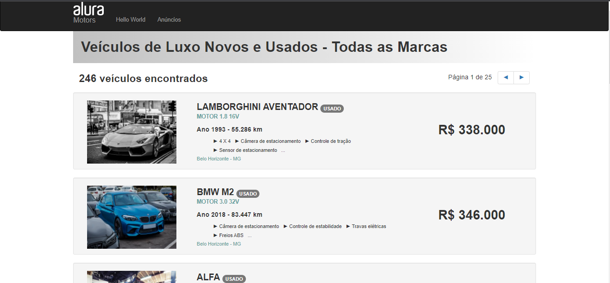

## Projeto criado no [curso de Web Scraping](https://cursos.alura.com.br/course/web-scraping-data-science-python) com Python da Alura

### O projeto faz uma raspagem de dados do site [Alura Motors](https://alura-site-scraping.herokuapp.com/):

- Cria um [arquivo csv](output/data/dataset.csv) com as categorias dos anúncios de carros (valor, nome, motor..) 
- Baixa as [imagens](output/img) em uma pasta separada
